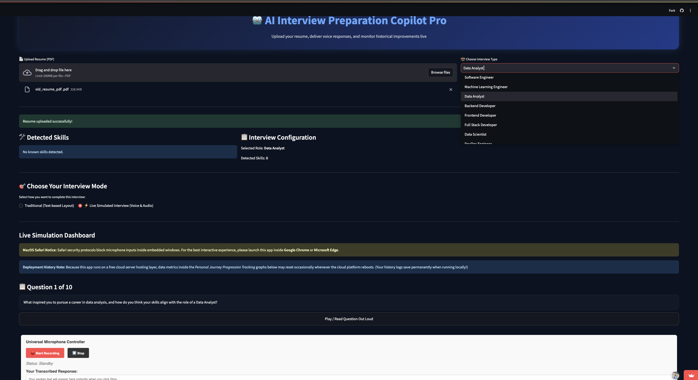
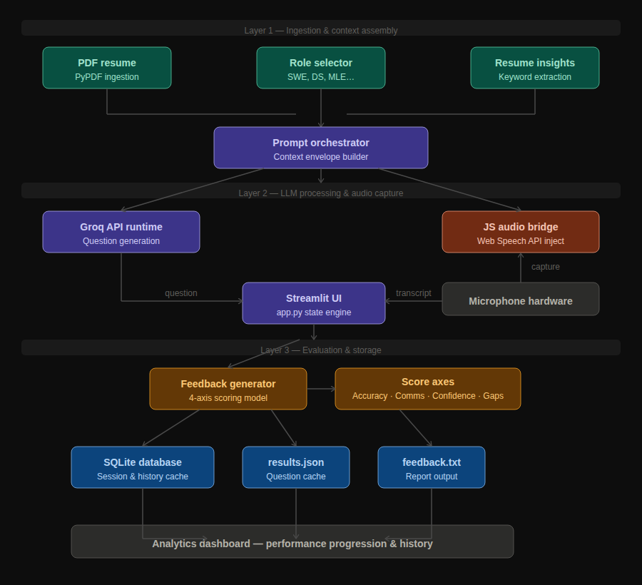

# Interview Preparation Copilot

An enterprise-grade, full-stack technical interview simulation platform engineered to automate role-specific candidate evaluations. The application ingests unstructured resume data, orchestrates context-aware question generation via high-performance LLM engines, and captures verbal candidate responses through a custom sandbox-isolated browser audio bridge to output quantified behavioral and technical performance telemetry.

The platform is designed to overcome standard cloud hosting limits. By injecting client-side JavaScript layers to bypass cross-origin browser restrictions and structuring model responses into deterministic validation schemas, the application provides instantaneous, high-fidelity interview scoring with zero localized compute overhead.

### Application Preview and System Design

<p align="center">
  
</p>

To complement the live runtime preview, the schematic below documents the underlying data engineering pipeline that powers this visualization, from initial multi-source API aggregation to the final frontend render stack:

<p align="center">
  
</p>

---

## Table of Contents
1. [System Architecture & Runtime Notes](#1-system-architecture--runtime-notes)
2. [Directory Structure and Component Roles](#2-directory-structure-and-component-roles)

---

## 1. System Architecture & Runtime Notes

The system is built using a decoupled, event-driven architecture that isolates file parsing and high-latency LLM completions from the interactive user interface loops to ensure fluid, sub-second view updates.

### Technical Pipeline Breakdown
* **Document Parsing Engine:** Utilizes a decoupled `PyPDF` ingestion layer to extract raw text blocks from user resume documents, filtering out layout noises and compiling the data into flat string tokens.
* **Context-Driven Prompt Orchestration:** Merges parsed resume profiles with user-selected target roles (e.g., Software Engineer, Data Scientist, ML Engineer). This structured envelope is fired at a high-efficiency **Groq API runtime**, utilizing highly optimized system prompts to generate precise, non-generic technical questions.
* **Client-Side Browser Sandbox Bypass:** Traditional Streamlit audio recorders fail when deployed inside Cloud iframe micro-services due to browser sandbox permission blocks. This system overrides this limitation by injecting an asynchronous, client-side JavaScript bridge. It safely captures physical microphone inputs, triggers native browser transcription engines, and pipes the transcribed text back into the Python execution line.
* **Telemetry Evaluation & Storage:** The candidate's response is compared against the initial question context using localized grading prompt constraints. The resulting unstructured model output is forced into structured arrays evaluating four explicit axes: *Technical Accuracy, Communication, Confidence, and Missing Points*.

> **Global Session Aggregation Note** > This production prototype leverages a global file-based SQLite database instance. Because there is no formal user authentication layer implemented for this public staging build, performance analytics, historical metrics, and data plots are aggregated globally across all active web sessions. 

> **Ephemeral Cloud Hosting Lifecycle Note** > Because the staging live app runs on an ephemeral, free cloud server hosting layer, data metrics inside the Personal Journey Progression Tracking graphs may reset occasionally whenever the cloud platform reboots or goes idle. Note that your history logs save permanently and securely when running this architecture locally on a workstation!

> **MacOS Safari Security Notice** > Strict Safari security protocols automatically block media capture device permissions (microphone inputs) when executed inside third-party embedded windows or cloud iframes. For the intended fully interactive vocal simulation experience, please launch this staging application inside Google Chrome or Microsoft Edge.

---

## 2. Directory Structure and Component Roles

The application codebase isolates tasks into specialized script layers to enforce an architectural separation of concerns:

```text
interview-copilot/
├── app.py                  # Primary layout orchestrator and Streamlit state engine
├── question_generator.py   # Handles Groq API interactions and prompt structuring
├── resume_parser.py        # Ingests and sanitizes PDF text using PyPDF engines
├── resume_insights.py      # Extracts core technical keywords and experience tokens
├── feedback_generator.py   # Processes answers, scores arrays, and yields analytics
├── styles.css              # Custom layout properties for production UI theme UI
├── results.json            # Flat-file cache of localized question matrix histories
└── feedback.txt            # Serialized candidate performance report outputs

